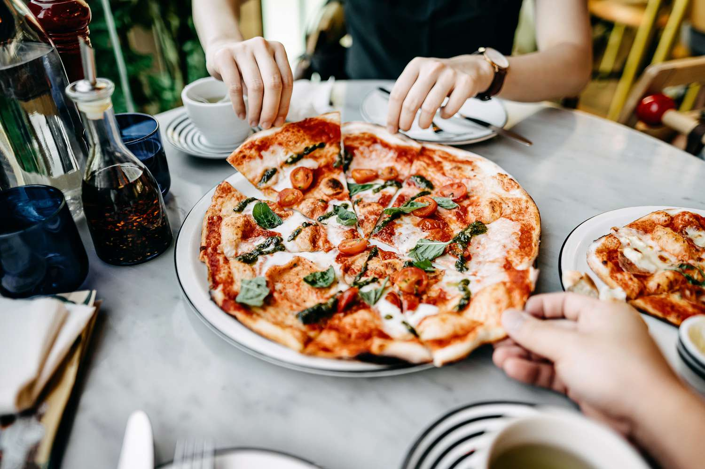

# Sparktan-Slices-Pizza-Sales-Analysis

## Introduction
### Scenario: 
You are a Data Analyst working Spartan Slices Pizza, a Greek-inspired pizza place in Florida, USA. You've been hired to help the restaurant make things work better using data. The manager welcomed you and mentioned that things are alright at Spartan Slices, but there's room for improvement. They've been collecting transaction data for a year, but haven't really been able to use it well. They hope you can analyze the data to help them find ways to increase sales and work more efficiently.

### KPIs that should be identified:
-	Total Revenue
-	Average Order Value
-	Total Pizzas Sold
-	Total Orders
-	Average Pizzas per Order
Other metrics that need to be explored: 
-	Daily and monthly trend for total orders 
-	Percentage of sales for pizza category and size
-	Total pizzas sold by category
-	Top 5 best/ worst sellers by revenue, quantity, and number of orders.

### This dataset provides 12 important characteristics regarding pizza sales:
- order_id: An unique identifier for each order made at a table.
- order_details_id: A unique identifier for each pizza within an order (pizzas of the same type and size are grouped together, and the quantity increases).
- pizza_id: A distinct key identifier linking the ordered pizza to its specifics, such as size and price.
- quantity: The number of pizzas ordered of the same type and size.
- order_date: The date when the order was placed (noted before cooking and serving).
- order_time: The time when the order was placed (noted before cooking and serving).
- unit_price: The cost of the pizza in USD.
- total_price: Calculated by multiplying the unit_price by the quantity.
- pizza_size: The size classification of the pizza (Small, Medium, Large, X Large, or XX Large).
- pizza_type: A distinct identifier connecting the pizza order to its attributes, like size and price.
- pizza_ingredients: The ingredients used in the pizza as displayed on the menu (all variations include Mozzarella Cheese, unless not specified; and all include Tomato Sauce, except if another sauce is stated).
- pizza_name: The title of the pizza as presented on the menu.

A preview of the dataset:

## Data Cleaning
Excel is used to clean raw data

-	Handling missing values: No missing values was found 
-	Removing duplicates: No duplicates was found
-	Changing data types: Change data types of order_date column to Date and order_time column to Time.

## Data Analysis
The dataset is analyzed using SQL

**1. KPI**

**a. Revenue**

The total revenue of the pizza sales is $817,860.

**b. Average order Value**

The average order value is $38.31.

**c. Total pizzas sold**

The total number of pizzas sold is 49,574.

**d. Total orders**

The total number of orders is 21,350.

**e. Average number of pizzas per order**

The average number of pizzas per order is 2.32.

**2. Other key insights**

**a. Daily trend and monthly trend for total sales**

**a.1. Daily trend for total sales**

Sales show varying patterns across the days of the week, with the highest daily orders on Fridays (3,538), Thursdays (3,239) and Saturdays (3,158). In contrast, Mondays (2,794) and Sundays (2,624) see lowest sales.

**a.2. Monthly trend for total sales**

Monthly sales also exhibit varying patterns. Peak months are July (1,935), May (1,853), and January (1,845) while lowest sales are observed in December (1,680) and February (1,685).

**b. Percentage of sales by category and size**

**b.1 Percentage of sales by category**

Sales distribution by category shows a relatively balanced preference among customers. The largest percentage of sales belongs to the Classic pizza category (26.91%), followed by Supreme (25.46%) and Chicken (23.96%), while Veggie accounts for the smallest share (23.68%).

**b.2. Percentage of sales by pizza size**

Sales distribution by pizza size indicates varying customer preferences: L takes up the largest percentage (45.89%), followed by M (30.49%) and S (21.77%). XL and XXL have the smallest shares of revenue, with only 1.72% and 0.12%, respectively.

**c. Total pizzas sold by category**

Among the pizza categories, the Classic category has the highest sales with 14,888 units sold, trailed by Supreme (11,987 units) and Veggie (11,649 units). The Chicken category records the lowest sales with 11,050 units.  

**d. Top 5 best sellers by revenue, quantity and order**

**d.1. Top 5 best sellers by revenue**

**d.2. Top 5 best sellers by quantity**

**d.3. Top 5 best sellers by order**

From the top 5 best sellers across the 3 categories, it can be seen that Thai Pizza, with the highest revenue and Classic Deluxe, with the most quantity and orders, are two most outstanding items. Additionally, Barbecue Chicken, Hawaiian and Pepperoni also demonstrates remarkable performances with their appearances in all 3 tables.

**e. Top 5 worst sellers by revenue, quantity and order**

**e.1. Top 5 worst sellers by revenue**

**e.2. Top 5 worst sellers by quantity**

**e.3. Top 5 worst sellers by order**

Brie Carre is the worst seller, with the lowest sales in revenue, quantity, and orders. Additionally, Mediterranean and Spinach Supreme also emerge as notable underperformers, appearing in all three tables.

## Visualization

PowerBI is used to created a dashboard visualizing the data

## Recommendations

Based on above findings, some recommendations can be made for the restaurant's manager:

-	As Thursday, Friday and Saturday have the highest order volumes, additional staff and resources should be allocated to handle the increased demand on these days, especially Friday. As Sunday and Monday have lower orders, the restaurant can introduce promotions to encourage more sales on these days.

-	The manager should adjust inventory levels and ingredient purchases based on the monthly trend for total orders. During peak months like July and May, inventory should be scaled up, and during off-peak months like October and September, a more conservative approach is advisable. Additionally, conducting further investigations to understand the reasons behind specific months' order fluctuations can lead to more effective strategies.

-	With regards to categories, as Class and Supreme have higher demand and contribute more to total revenue, the manager should consider running more promotions or marketing strategies to maintain their popularity. It is also advisable to introduce more items or variations within these categories. Moreover, attention should still be paid to Veggie and Chicken. Although they have lower demand and contribute less to total revenue, their contributions are still significant and strategies should be developed to optimize their sales.

-	Best sellers like Thai Chicken Pizza and Classic Deluxe Pizza, with L size, should be further promoted by marketing campaigns and pricing strategies so that the restaurant can capitalize on customers’ love for them.

-	For worst sellers like Brie Carre Pizza, Spinach Supreme Pizza and Mediterranean Pizza, it is advised to further analyze why they are low in demand, considering their recipes, prices, and local preferences. After that, actions like modifications of these pizzas or removals of them from the menu can be made.

